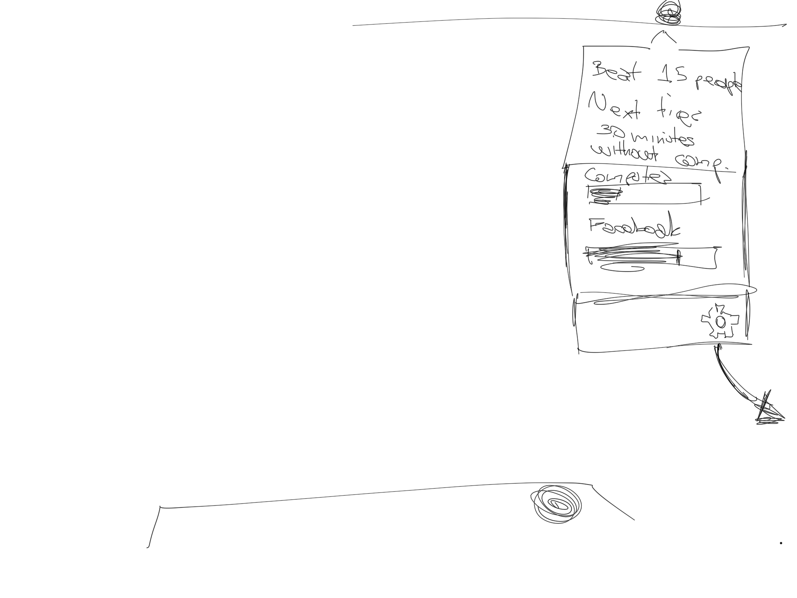
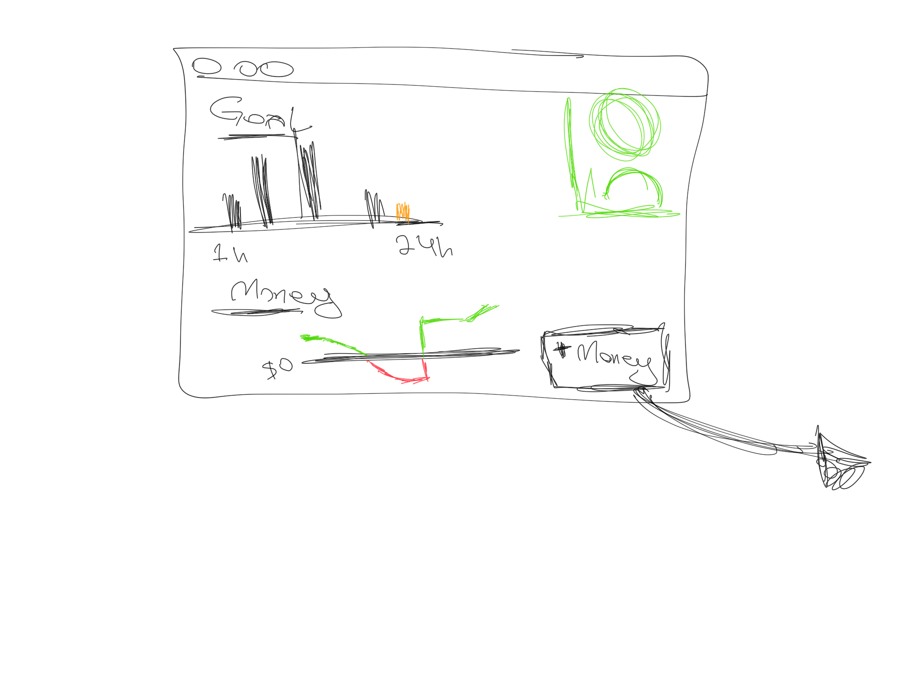

# Lecture 0: Project Proposal

# Project Ideas

- It all starts with a great idea, right?
  - I don’t think so: Silly ideas may be better than great ones, because they don’t cause paralysis.
- Real-world silly ideas:
  - [A blog, except your posts are limited to 140 characters](https://twitter.com).
  - [A smart mug](https://ember.com).
  - [A Wi-Fi connected juicer](https://en.wikipedia.org/wiki/Juicero).
- One of my silly ideas (I actually thought about this on my way to the classroom):
  - **Shame Roulette:** A browser extension that may, with some probability, tweet what you search on a private tab.
- More silly ideas I had before, but didn’t share in class:
  - A weather application that shows the weather from years ago.
  - Google Docs, but for writing lyrics for songs, helping with rhymes, rhythm, and so forth.
- Where do ideas come from?
  - Scratching your own itch.
  - Something someone said on a TV show, or Reddit, and so forth.
  - A remix of existing ideas.
  - Something that you think will make people laugh.
- Come up with your own silly ideas.

# Project Proposal

- The conversations we had in the classroom when developing our project proposal are what some people call _Product Discovery_.
- [Template](/iterations/0#template).
- See the proposal we wrote together [below](#time--money).
- We didn’t get to cover this in class, but more formal proposals include:
  - [Use Cases](https://www.seguetech.com/user-stories-vs-use-cases-pros-cons-agile-development/).
  - Business plan.

# Welcome to OOSE

- We didn’t have time to have the conversation below in class, but it’s part of [Assignment 0](/assignments/0#software-engineering).
- Software Engineering: Science or art?
  - For me, a mix of both, but mostly an art: an exercise in empathy.
- Software Engineer: What makes one?
  - For me, writing code: you’re a software engineer already.
  - The industry needs new people.
- Goals?
  - Make you a more confident software engineer.
  - Give the language to communicate ideas about software.
    - Allow you to _think_ those ideas.
  - Elevate the level of discourse (from things like the syntax of a programming language to the principles behind a library like [React](/toolbox#user-interface-builder-react)—which is [functional programming](/lectures/9#functional-programming), in case you’re wondering).
- Course parts:
  - Principles (Lectures): The things that last.
  - Practice (Group Projects & Laboratory Sessions): The only way to learn.
  - Technology (Online Videos): The things that change.
- [Website](/).
- [Assignment 0](/assignments/0) & [Iteration 0](/iterations/0).
- Dr. Scott: Course creator and professor for many years.

# The Project Proposal We Wrote Together in Class

**⚠️  The only person who may use this project proposal for his [Assignment 0](/assignments/0) is the original author of the idea, and even him has to flesh this out significantly.**

# Time = Money

# Elevator Pitch

People are addicted to technology. Time = Money is an app in which you bet that you won’t waste time in the computer. If you manage to do it, you get your money back, plus some extra, otherwise you loose.

# Problem

Addiction to technology.

## Introduction to Domain

# Solution

- Let people bet their money.
- Check whether they used their time with technology appropriately. These goals are in tiers, for example, 30 minutes or one hour, and people play in their own brackets.
- Either reward the user or not.

## Architecture Overview

- Desktop app
- Mobile app
- Web server

## Features

- Let people bet their money.
- Check whether they used their time with technology appropriately. These goals are in tiers, for example, 30 minutes or one hour, and people play in their own brackets.
- Either reward the user or not.
- Maybe use a blockchain, ’cause blockchains are freaking hot these days, I’m want me some money too…

## Wireframes

**Desktop Tray Widget**

**Desktop Dashboard**

## User Stories

As a person betting on the application, I want to spend five hours out of the computer today, so I click on bet money, and maybe I get a notification after so many hours have passed.

# Viability

## Hardware

- Yes, we all have the necessary hardware.

## APIs

- Integration with ScreenTime in iOS (and macOS in the future)

## Tools

- XCode: Because I’m developing for iOS, what do you expect? We decided not to use React Native because we found that it doesn’t support some native integration that we need.
- Swift
- Cocoapods
- Python: Just ’cause we like it…

## Proof of Concept

- Here’s a code base to prove that we can detect the use of other apps even when our app is asleep (not the phone).

# Difficulty

This project is sufficiently interesting because we have to track hours, and we show notifications, and we have to solve this interesting technical problem that is receiving money online without being hacked…

# Market Research

## Users

- Basically everyone. Because basically every is addicted to technology one way or the other.

## Competition

- ScreenTime: But we aren’t the same because of the betting component.

# Roadmap

We played fast and loose and created the roadmap for this application in the [TODOOSE](https://github.com/jhu-oose/todoose) repository.

<https://github.com/jhu-oose/todoose/projects/4>
