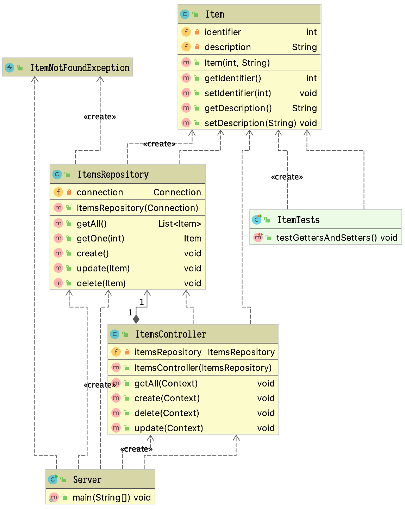

# Lecture 1: Design Rudiments

# Class Diagrams

- Come up with features for TODOOSE:
  - Users.
  - Different kinds of users, for example, project manager, software developer, and so forth.
  - Private and public lists.
  - Reordering items.
  - Nesting (indentation).
  - Multiple lists (move tasks between lists).
  - Notes & other item data.
  - Scheduling.
  - Synching with other providers (Apple Reminders, Google Keep, and so forth).
- Can we start writing code already?
  - Consider design.
    - When we talk about _design_ we mean design of the _code_, not _graphic design_.
    - And planning in general: writing pseudo-code, writing correctness proofs, and so forth.
    - _Unified Modeling Language_ (UML).
    - There are _many_ types of diagrams, we’ll only talk about Class Diagrams.
    - An UML diagrams of the different types of UML diagrams (so meta!) (from [Wikipedia](https://en.wikipedia.org/wiki/Class_diagram)):
      {:width="385"}
  - Yes:
    - _Emergent Design_.
    - Diagrams may merely document existing code.
    - That’s what happened with TODOOSE: we started with code, and now we can reflect on what we did and draw diagrams about it.
    - Diagrams are just a different perspective, and it may give you new insight.
  - No:
    - _Big Design Up Front_ (BDUF) or _Rough Design Up Front_ (RDUF).
    - Complex systems.
    - You’re architecting something for other people to build, for example, a plugin system (diagrams may be part of the documentation for plugin developers), or a network protocol (diagrams may help you communicate with browser developers), and so forth.
- Levels of abstraction:
  - Depends on your audience, and on what you want to communicate.
  - Some diagrams correspond one-to-one with code.
  - Some diagrams are open to interpretation and convey only high-level ideas.

# Architecture

- Low-level class diagram in IntelliJ for the whole `com.jhuoose.todoose` package:
  {:width="575"}
- Read diagram and code side-by-side:
  - Classes:
    - Fields.
    - Constructors (parameters).
    - Methods (parameters and return types).
    - Visibility.
  - Relationships:
    - Dependency (dashed arrow).
    - Annotations on edges, for example, «create».
    - Association (solid arrow).
    - Multiplicity (`3`, `1..2`, `*`, and so forth).
    - Whole-part diamond.
    - Most things about the syntax of the diagram are intentional, for example, the shape of the arrowhead, whether the diamond is filled in or not, and so forth.
    - See [Wikipedia](https://en.wikipedia.org/wiki/Class_diagram) article for more on syntax.
    - Common mistake: Relationships must be between two classes (except for inheritance, because the arrow makes the relationship clear).
- A lot of information: getters and setters, `identifier` field, extra arrows, and so forth.

# High-Level Class Diagrams

- Omit:
  - Classes like controllers, repositories, server, and so forth.
  - Getters and setters.
  - Obvious attributes, for example, identifier.
- Include:
  - Classes that are models.
- Sketch class diagram for some of the features we thought in the beginning of class.
  - Class diagrams must match the features, the wireframes, and everything else in the project proposal.
  - Nouns → Classes.
  - Verbs → Methods (or Classes, if they’re sufficiently complicated).
  - Inheritance.
- Common mistake:
  - Abuse inheritance (“is-a” relationship).
