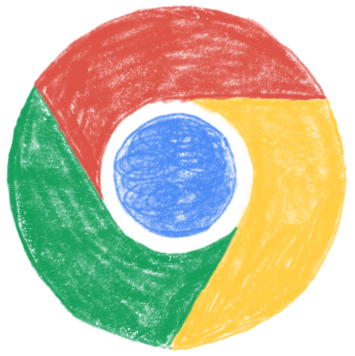
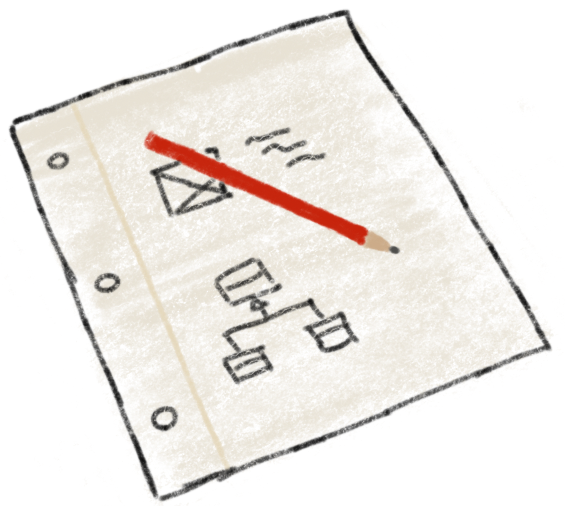
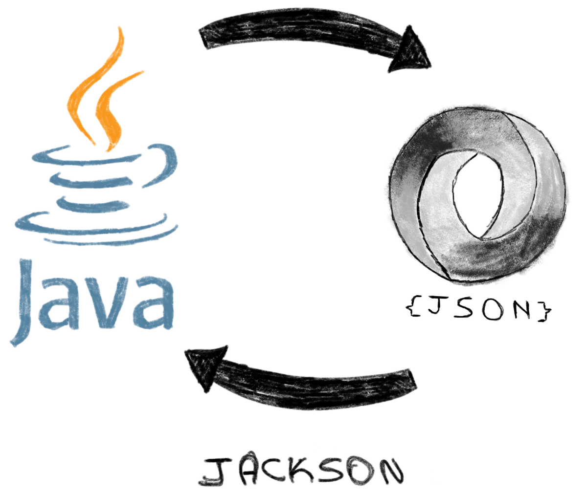
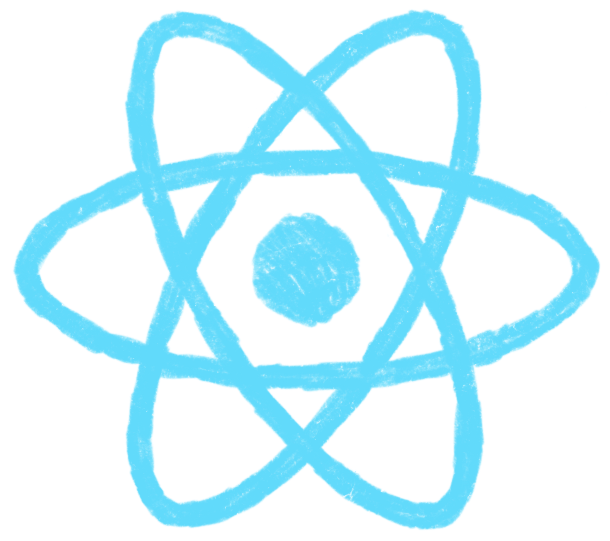

Toolbox
=======
{:.no_toc}

<figure markdown="1">
{:width="386" height="291"}
</figure>

The Toolbox is a collection of tools curated by the course staff for programming assignments and group projects.

How to Read
-----------
{:.no_toc}

**First Read.** Read the rest of this introduction and go though the list of tools following the instructions on the sections named **Where to Get it**. *If you have installed one of these tools in the past, you must update it.*

**Second Read.** Read the sections named **What it is** and **Our Choice**.

**Third Read.** Refer to [TODOOSE](https://github.com/jhu-oose/todoose) for an example of the tools in action and follow the instructions on the sections named **How to Learn it**. Don’t try to learn everything at once—it’s *a lot* of material.

Architecture: Web Application
-----------------------------
{:.no_toc}

The tools in the Toolbox form the foundation of a web application. This architecture is the most common for modern applications, and it illustrates good software-engineering principles, for example, separation of concerns, segregation of interfaces, and so forth. The two main components of a web application are the *server* and the *client* (which typically is a web browser). The tools in the Toolbox cover the whole stack, from end to end, including server and client.

Reasons to Reach for Tools that aren’t in the Toolbox
-----------------------------------------------------
{:.no_toc}

While you’re restricted to the tools in the Toolbox for the programming assignments, on your group project you’re free to reach for other tools. Here’s why you may want to do that:

**The Project Needs it.** This is probably the best reason.

**Fun.**

**Profit.** <!-- TODO: CV. -->

<!-- TODO: For example, if your group decides to deviate from the recommended architecture and build not a web application but a mobile application, then you need a tool that isn’t in the Toolbox, for example, Swift, or Android, or React Native, and so forth. Another common reason to reach for a tool that isn’t in the Toolbox is that it’s new and fun, and your group wants to try it out. This is fine, but it’s also a risk that only advanced groups should take.  -->

Reasons to Stick with the Tools in the Toolbox
----------------------------------------------
{:.no_toc}

**Familiarity**. Your group members already know the tools in the Toolbox from the programming assignments.

**Cost.** You must spend some time to learn a tool that isn’t in the Toolbox, to make it work with the rest of the tools, and so forth.

**You’re on your Own.** We may not know how to help you if you get stuck.

**No Extra Points.** We evaluate projects based on their technical merits rather than on what tools they use.

In summary: If your project fails because of issues with tools that *aren’t* in the Toolbox, *you* failed. If your project fails because of issues with tools that *are* in the Toolbox, *we* (the course staff) failed.

Criteria for Curating the Tools (in Order of Importance)
--------------------------------------------------------
{:.no_toc}

**Minimalism.** The tools must carry their weight. Fewer tools are better than more.

**Multiplatform.** The tools must work on macOS, Linux, and Windows. You should be able to use them regardless of what computer you have.

**Beginner-Friendly.** The tools must be relatively easy to install and to use, they must be well documented, and they must demonstrate good software-engineering principles.

**Integration.** The tools must work well together.

**Industry Standard.** The tools must not be pedagogical toys, but must actually be used in industry.

Tools in the Toolbox
--------------------
{:.no_toc}

* TOC
{:toc}

Development Tools
=================

Integrated Development Environment (IDE): IntelliJ IDEA
-------------------------------------------------------

<figure markdown="1">
{:width="344" height="350"}
</figure>

**What it is.** An IDE allows you to edit source code, invoke the compiler, interact with the debugger, and so forth.

**Our Choice.** IntelliJ IDEA is the modern industry standard, after it *eclipsed* the competition. Also, it’s the foundation of Android Studio.

**Where to Get it.** [Follow these instructions](https://www.jetbrains.com/idea/download/). Install the *Ultimate* edition, not the *Community* one. The Ultimate edition a commercial product, so [apply for a student license](https://www.jetbrains.com/student/)—they typically accept the application quickly. The Ultimate edition includes features that the Community doesn’t and that are useful in the course, for example, support for [JavaScript](#programming-language-javascript) and [database tools](#database-management-systemdbms-sqlite).

**How to Learn it.** First, fiddle with it for a couple of hours. If after that you still want some help, refer to the [documentation](https://www.jetbrains.com/idea/documentation/).

Application Programming Interface (API) Development Environment (ADE): Postman
------------------------------------------------------------------------------

<figure markdown="1">
{:width="348" height="351"}
</figure>

**What it is.** An Application Programming Interface (API) establishes *what* functionalities the server provides to the client and *how* it provides them. Once the API is designed, different people may work on the server and on the client independently, maybe even in parallel, and as long as both sides follow the API, the application will work in the end. An ADE helps you design the API, document it, test it, interact with it, and so forth.

**Our Choice.** Postman invented the idea of an ADE; it is the industry standard in this area and stands without competition.

**Where to Get it.** [Follow these instructions](https://www.getpostman.com/downloads/). You may have installed Postman as a browser extension in the past, but it has been discontinued, so switch to the standalone version.

**How to Learn it.** First, fiddle with it for a couple of hours. After doing that, [visit the Postman Learning Center](https://learning.getpostman.com). In particular, read the sections about testing, which include the [Postman Sandbox](https://learning.getpostman.com/docs/postman/scripts/postman_sandbox) and its [API Reference](https://learning.getpostman.com/docs/postman/scripts/postman_sandbox_api_reference/) (this is Postman Sandbox’s API for testing, not to be confused with the application API which is the thing you’re designing in Postman). Postman tests are written in [JavaScript](#programming-language-javascript) using the [Chai](https://www.chaijs.com/api/bdd/) library for expectations.

Browser: Google Chrome
----------------------

<figure markdown="1">
{:width="350" height="352"}
</figure>

**What it is.** Typically a web application is expected to work in any browser, but in the interest of keeping things simple, we select a single browser. This is a somewhat realistic constraint because, while making an application work in multiple browsers used to be difficult to do in the past, recently incompatibilities between browsers are fewer and further between.

**Our Choice.** Google Chrome is the most popular browser and includes some of the most advanced developer tools.

**Where to Get it.** [Follow these instructions](https://www.google.com/chrome/).

**How to Learn it.** Of course you already know how to use a web browser—you’re reading this, after all. But must also learn how to use the [developer tools](https://developers.google.com/web/tools/chrome-devtools/), which include an HTML/CSS/JavaScript inspector, a network inspector, a JavaScript console, a JavaScript debugger, and much more.

Version Control System (VCS): Git
---------------------------------

<figure markdown="1">
{:width="356" height="351"}
</figure>

**What it is.** A VCS is like a time machine for your code base: the VCS can save the state of the code base over time and help you navigate in its history. Also, a VCS lets multiple people coordinate their work on the same code base.

**Our Choice.** Git is the most used VCS and is also one of the most sophisticated.

**Where to Get it.** [Follow these instructions](https://git-scm.com/downloads) to install Git. Then, to configure it:

1. Inform Git your [name](https://help.github.com/en/articles/setting-your-username-in-git#setting-your-git-username-for-every-repository-on-your-computer) and [email](https://help.github.com/en/articles/setting-your-commit-email-address-in-git#setting-your-email-address-for-every-repository-on-your-computer), which will be used to identify your contributions to the code base. Use an email that will belong to you forever, not, for example, your university email. You may use a different email from the one on your account on the [project manager](#project-management-github).
2. Create [a global `.gitignore`](https://help.github.com/en/articles/ignoring-files#create-a-global-gitignore), which lists the kinds of files that must never be versioned with Git because they don’t belong to a project, but to your machine, for example, the `.DS_Store` files generated by Finder on macOS. A minimal `.gitignore` includes the following:

   ```
   # Ignore the project configuration files generated by IntelliJ IDEA
   # because they’re different for every machine.
   .idea
   # Ignore the files generated by Finder if you’re running macOS.
   .DS_Store
   ```

3. [Create an SSH key if you don’t already have one](https://help.github.com/en/articles/connecting-to-github-with-ssh).

**How to Learn it.** Use Git from within the [IDE](#integrated-development-environmentide-intellijidea). For more advanced topics, or to learn about using Git from the command-line, refer to [*Pro Git*](https://git-scm.com/book).

Project Management: GitHub
--------------------------

<figure markdown="1">
{:width="264" height="260"}
</figure>

**What it is.** A project management tool provides a way to manage what needs to be done in the project, who’s working on what, and so forth. A project management tool also hosts the canonical [version](#version-control-systemvcs-git) of the repository containing the code base.

**Our Choice.** GitHub is the most popular Git host. Its project-management tools are simple but cover everything you need for the group projects.

**Where to Get it.** [Follow these instructions to create an account](https://github.com/join), and [add the SSH key](https://help.github.com/en/articles/adding-a-new-ssh-key-to-your-github-account) you created when configuring the [version control system](#version-control-systemvcs-git).

<!--
TODO:
- Add 2FA.
- Request access to the `jhu-oose` organization.
-->

**How to Learn it.** Go through the exercises in the [GitHub Learning Lab](https://lab.github.com) and the articles in the [GitHub Guides](https://guides.github.com).

Wireframing & Diagramming: Paper & Pencil
-----------------------------------------

<figure markdown="1">
{:width="283" height="253"}
</figure>

**What it is.** A wireframe is a rough sketch of the user interface which includes what features are available and how they are presented. A diagram is a visual representation of some aspect of the application technical design (not to be confused with its *graphic* design), for example, what classes exist in the system and how they communicate.

**Our Choice.** Paper & Pencil prevents you from complicating wireframes and diagrams with information that doesn’t belong in them. Wireframes should not be concerned with font choices, colors, and so forth. Diagrams should not include too many classes, attributes, methods, and so forth, particularly those that can be inferred from context, for example, getters and setters.

**Where to Get it.** I trust you can figure this one out.

**How to Learn it.** There is no set of rules on how to wireframe, but there is [a common language that people tend to use](https://www.usability.gov/how-to-and-tools/methods/wireframing.html). The kinds of diagrams in which we’re interested in this course, however, *do* follow a set of rules, the so-called Unified Modeling Language (UML). Unlike programming languages, UML is a visual language, and it defines how certain elements should look in the diagrams, for example, how inheritance is notated with an unfilled arrowhead. UML defines many kinds of diagrams, but in this course we’re mainly interested in one: [class diagrams](https://www.ibm.com/developerworks/rational/library/content/RationalEdge/sep04/bell/index.html).

Server
======

Programming Language: Java
--------------------------

<figure markdown="1">
{:width="205" height="345"}
</figure>

**What it is.** The programming language for the server side of your applications.

**Our Choice.** Java is the quintessential object-oriented programming language; it is widely used in industry; and you probably already know it from previous courses.

**Where to Get it.** [Follow these instructions](https://www.oracle.com/technetwork/java/javase/downloads/index.html). Install the Java Development Kit (JDK) for the Java Platform, Standard Edition (SE).

**How to Learn it.** Refer to an introductory Java book, for example, [Core Java](https://horstmann.com/corejava/index.html), if you want to brush up on the basics of Java: syntax, classes, objects, inheritance, interfaces, exceptions, generics, polymorphism, method overloading and overriding, invoking the compiler, and so forth. Beyond the basics, we also use some Java features that are more modern, for example, [lambdas](https://medium.freecodecamp.org/learn-these-4-things-and-working-with-lambda-expressions-b0ab36e0fffc) and [local type inference](https://www.journaldev.com/19871/java-10-local-variable-type-inference).

Build System: Gradle
--------------------

<figure markdown="1">
{:width="491" height="161"}
</figure>

**What it is.** A build system invokes the compiler for all the files with source code in your project, manages third-party libraries in which your project may depend, and so forth.

**Our Choice.** Gradle is one of the most popular and widely adopted build systems for Java, though this space is crowded and fractured. Gradle is relatively easy to use (for example, its configuration files are simpler than the XML-based ones used by [Maven](https://maven.apache.org), which is another popular build system for Java), and it is the build system used by default in Android projects.

**Where to Get it.** The [IDE](#integrated-development-environmentide-intellijidea) gets it for you.

**How to Learn it.** Find packages to install at the [The Central Repository](https://search.maven.org): look for the package name to find its latest version, and follow the instructions for Gradle. Use the [IDE](#integrated-development-environmentide-intellijidea) to run the basic tasks, for example, compiling, and running the [automated tests](#testing-framework-junit). If you need to dive deeper, refer to the [Gradle Documentation](https://docs.gradle.org/).

Web Server: Javalin
-------------------

<figure markdown="1">
{:width="434" height="122"}
</figure>

**What it is.** A Java library for developing web servers.

**Our Choice.** Javalin abstracts the low-level aspects of the communication between server and client while avoiding abstractions that would obscure how things work and confuse beginners.

**Where to Get it.** Add `io.javalin.javalin` as a dependency to the project, and the [build system](#build-system-gradle) downloads and installs it. Besides Javalin itself, also add a logger, [*Simple Logging Facade for Java (SLF4J)*](https://www.slf4j.org) (`org.slf4j.slf4j-simple`), so Javalin can log important information while it’s running.

**How to Learn it.** [Read the documentation](https://javalin.io/documentation).

JSON Mapper: Jackson
--------------------

<figure markdown="1">
{:width="600" height="504"}
</figure>

**What it is.** A [Java](#programming-language-java) library for mapping back and forth between data structures and [JSON](#data-interchange-format-javascript-object-notationjson).

**Our Choice.** Jackson is the default JSON mapper for [the web server](#web-server-javalin).

**Where to Get it.** Add `com.fasterxml.jackson.core.jackson-databind` as a dependency to the project, and the [build system](#build-system-gradle) downloads and installs it.

**How to Learn it.** Read the [documentation](https://github.com/FasterXML/jackson-databind) and the [wiki](https://github.com/FasterXML/jackson-databind/wiki).

Testing Framework: JUnit
------------------------

<figure markdown="1">
{:width="355" height="109"}
</figure>

**What it is.** A testing framework allows you to write automated tests, which are small programs which check that your application is behaving correctly. Writing the tests helps you figure what the correct behavior should be. Also, the tests serve as a form of low-level executable documentation. Finally, the tests prevent future modifications from breaking the application.

**Our Choice.** JUnit is the most popular and straightforward testing framework for Java.

**Where to Get it.** Add `org.junit.jupiter.junit-jupiter-engine` as a dependency to the project, and the [build system](#build-system-gradle) downloads and installs it.

**How to Learn it.** [Read the User Guide](https://junit.org/junit5/docs/current/user-guide/).

Database Management System (DBMS): SQLite
-----------------------------------------

<figure markdown="1">
{:width="600" height="270"}
</figure>

**What it is.** When we turn the server off, it *forgets* all the application data (that is, all the Java objects that existed in the memory). A DBMS runs alongside the server, and when we use it to the application data, it *remembers* the data even across server runs. Also, a database preserves data integrity and consistency, for example, it may enforce the constraint that all users in your application have a phone number.

**Our Choice.** Typically a web application would use a DBMS with a client–server architecture (this is a client–server architecture with respect to the DBMS, in which the DBMS is the server and the application server is actually the client). The most popular DBMS with a client–server architecture is [PostgreSQL](https://www.postgresql.org). A client–server architecture scales better, particularly when multiple server components need to communicate with a central DBMS. But in this course we prefer SQLite precisely because it is serverless—the database is just stored in a regular file. SQLite is easier to install and to manage, and it’s available everywhere, including phones. But there are some issues with [deploying SQLite databases to our platform of choice](#platform-heroku), which you may address by switching to PostgreSQL.

**Where to Get it.** Add `org.xerial.sqlite-jdbc` as a dependency to the project, and the [build system](#build-system-gradle) downloads and installs it. This Java library contains not only the drivers that the server needs to connect to the database, but also the DBMS itself.

**How to Learn it.** Manage the database by hand using the database tools in the [IDE](#integrated-development-environmentide-intellijidea). In your application, the server communicates with the DBMS using a language called Structured Query Language (SQL). If you’re new to SQL, start with this [course](https://www.codecademy.com/learn/learn-sql). Once you understand SQL, you must learn some things particular to SQLite, which you may find in [its documentation](https://www.sqlite.org/docs.html). In particular, learn about [SQLite’s data types and its dynamic type system](https://www.sqlite.org/datatype3.html), and [the particularities of SQLite’s SQL dialect](https://www.sqlite.org/lang.html).

Client
======

Programming Language: JavaScript
--------------------------------

<figure markdown="1">
{:width="381" height="369"}
</figure>

**What it is.** The programming language for the client side of your application.

**Our Choice.** JavaScript is the native programming language for the browser.

**Where to Get it.** It comes with [the browser](#browser-googlechrome).

**How to Learn it.** To begin with, read the [MDN Web Docs](https://developer.mozilla.org/en-US/docs/Learn/JavaScript) and [this tutorial](https://javascript.info). These should give you a fair notion of the basics of JavaScript, but the language is evolving fast and in this course we use the latest features, so read [this tutorial](https://babeljs.io/docs/en/learn.html) on what changed recently. Finally, keep up with the updates by searching the web for articles on ECMAScript 5, ECMAScript 6 (2015), ECMAScript 7 (2016),  ECMAScript 8 (2017), and so forth. (ECMAScript is the standard on which JavaScript is based. Isn’t it fun that ECMAScript is updated every year but the versions numbers *don’t* match the release year, for example, ECMAScript **8** was released in 201**7**?)

User Interface: Hypertext Markup Language (HTML) & Cascading Style Sheets (CSS)
-------------------------------------------------------------------------------

<figure markdown="1">
{:width="510" height="289"}
</figure>

**What it is.** HTML is the language in which to define the contents of the user interface. CSS is the language in which to define what the user interface looks like.

**Our Choice.** HTML and CSS are the native languages for user interfaces in the browser.

**Where to Get it.** It comes with [the browser](#browser-googlechrome).

**How to Learn it.** Read the MDN Web Docs on [HTML](https://developer.mozilla.org/en-US/docs/Learn/HTML) and [CSS](https://developer.mozilla.org/en-US/docs/Learn/CSS).

User-Interface Builder: React
-----------------------------

<figure markdown="1">
{:width="305" height="271"}
</figure>

**What it is.** A [JavaScript](#programming-language-javascript) library for rendering the [user interface](#user-interface-hypertext-markup-languagehtml--cascading-style-sheetscss) and keeping it up to date when the data changes.

**Our Choice.** This is a hot space in the software engineering world—there are many tools competing to solve the same issue. React is among the most popular, it is relatively easy to learn, and it’s based on simple ideas.

**Where to Get it.** Add React to the application using [the simplest method](https://reactjs.org/docs/add-react-to-a-website.html), including support for JSX with Babel. To make your application work locally even if your computer is offline, download the scripts instead of using the versions at `unpkg.com`. This quick-and-dirty method wouldn’t be good for applications that have hundreds of user, or that must to be as fast as possible, but it’s simple enough: it requires just a couple of `script` tags, instead of a JavaScript runtime (for example, Node.js) and a JavaScript build system (for example, webpack).

**How to Learn it.** Go through [the tutorial](https://reactjs.org/tutorial/tutorial.html) and read [the documentation](https://reactjs.org/docs/getting-started.html), including the sections on [JSX](https://reactjs.org/docs/introducing-jsx.html).

Client–Server Communication
===========================

Data-Interchange Format: JavaScript Object Notation (JSON)
----------------------------------------------------------

<figure markdown="1">
{:width="400" height="479"}
</figure>

**What it is.** The server and the client communicate via a protocol based on plain text (HTTP), but they need to exchange data that is more structured than plain text, for example, objects, lists, and so forth. A Data-Interchange Format is a convention on how to format structured data in plain text.

**Our Choice.** JSON is an industry standard. It is simpler and more lightweight than the other popular alternatives, for example, XML.

**Where to Get it.** You don’t *install* JSON the same way you install, say, Java, because JSON is just a convention on how to format data. But while it may be possible to map back and forth between data structures and JSON just by manipulating strings, you must use tools to streamline these tedious and error-prone tasks. On the server side, use a [Java library](#json-mapper-jackson); on the client side, use JavaScript, which already supports JSON natively (unsurprisingly, if you recall what JSON stands for).

**How to Learn it.** [Follow this tutorial](https://developer.mozilla.org/en-US/docs/Learn/JavaScript/Objects/JSON).

Deployment
==========

Platform: Heroku
----------------

<figure markdown="1">
{:width="494" height="148"}
</figure>

**What it is.** A platform to run the server and make it available to anyone on the Internet.

**Our Choice.** Heroku is among the simplest platforms for deployment, because it favors *convention over configuration*. It provides many important features so seamlessly that you won’t even notice they’re there, for example, a domain, and HTTPS support.

**Where to Get it.** [Create an account](https://www.heroku.com).

**How to Learn it.** [Read the documentation](https://devcenter.heroku.com).

Continuous Integration (CI) Server: Travis CI
---------------------------------------------

<figure markdown="1">
{:width="600" height="199"}
</figure>

**What it is.** At its simplest, a CI Server grabs the code base from the [project manager](#project-management-github), runs the automated tests, and reports on the results. In general, you may configure a CI Server to execute any task, for example, building the packaged version of the application to distributed to users, deploying the application to some platform, and so forth.

**Our Choice.** Travis CI integrates nicely with our [project manager](#project-management-github), and it’s among the most popular CI Servers on the market.

**Where to Get it.** Visit [`travis-ci.`**`com`**](https://www.travis-ci.com), not [`travis-ci.`**`org`**](https://www.travis-ci.org) (which is the [legacy platform](https://blog.travis-ci.com/2018-05-02-open-source-projects-on-travis-ci-com-with-github-apps)), and use the credentials from the [project manager](#project-management-github).

**How to Learn it.** [Read the documentation](https://docs.travis-ci.com).

Documentation
=============

Authoring Language: Markdown
----------------------------

<figure markdown="1">
{:width="388" height="263"}
</figure>

**What it is.** A language in which to write the project documentation, including the README, the CHANGELOG, and so forth.

**Our Choice.** Markdown is lightweight, simple, and natively supported by [the project manager](#project-management-github).

**Where to Get it.** The [IDE](#integrated-development-environmentide-intellijidea) already supports Markdown and provides a nice preview window of the rendered document.

**How to Learn it.** Markdown isn’t exactly a language, but a *family* of languages. There are *many* implementations of Markdown, and while they tend to implement the core features the same way, each provides different extended features. For this course, we use [GitHub Flavored Markdown](https://guides.github.com/features/mastering-markdown/).
